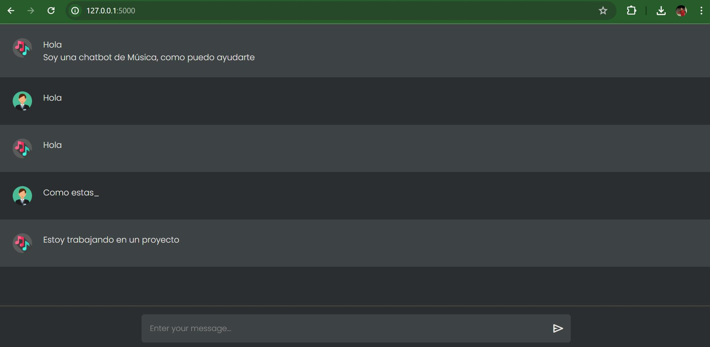

## Libraries
Library include in this github /ChatterBot

## Instructions to install
You can follow this instructions
```bash
https://chatterbot.readthedocs.io/en/stable/setup.html
```

You need to install
```bash
pip install spacy
pip install pyyaml

```

## If you can issues 
"""it looks like there's an issue with how SpaCy is being loaded."
You need to replace this lines for this
```bash
self.nlp = spacy.load(self.language.ISO_639_1.lower())
```
For this:
```bash
self.nlp = spacy.load("en_core_web_sm")
```
You need to come for root of SpaCy
In my path
```bash
C:\Users\felip\AppData\Local\Packages\PythonSoftwareFoundation.Python.3.7_qbz5n2kfra8p0\LocalCache\local-packages\Python37\site-packages\chatterbot\tagging.py

```

### Another issue
If the error now states that the model 'en_core_web_sm' cannot be found.
```bash
python -m spacy download en_core_web_sm
```

#### File YAML about Prompts
If you can configure a yaml file you need to install some prompts to work for example
```bash
https://github.com/gunthercox/chatterbot-corpus
```
You need to put in this path
```bash
chatterbot-corpus/data
C:\Users\felip\chatterbot_corpus\data
```
And you can test with main.py

## Final



